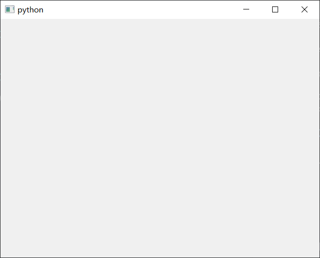
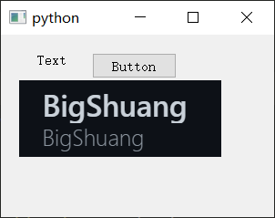

## pyqt5笔记 基础 窗口与控件 按钮点击

### 0 安装
一般可使用
```bash
pip3 install PyQt5
```

安装中下载太慢导致失败则使用
```bash
pip3 install PyQt5 -i https://pypi.tuna.tsinghua.edu.cn/simple
```
### 1 基础窗口
```python
from PyQt5.QtWidgets import *

import sys

app = QApplication(sys.argv)

window = QWidget()
window.show()

sys.exit(app.exec_())
```
这会建立一个这样的基础窗口



上面的代码中，
`window`是我们的主窗口对象，是`PyQt5.QtWidgets.QWidget`类的实例。
有如下常见方法：

```python
window.resize(100, 100)  # 设置窗口尺寸
window.move(300, 300)  # 设置窗口位置
window.setGeometry(300, 300, 300, 220)  # 定位且设置尺寸
window.setWindowTitle('Simple')  # 设置窗口标题
```

最后一句，让程序可以维持下去。
`sys.exit(app.exec_())`和`app.exec_()`都可以实现功能。

但是`sys.exit(app.exec_())`更好，在关闭窗口时还能告诉程序关闭成功与否。

### 2 添加控件
#### 添加文本标签
添加新的标签空间（指定文本，上级窗口）
```python
label = QLabel("Text", window)
```
把控件放置在指定位置
```python
label.move(20, 40)
```
`Qlabel`对象后面还可以使用`set_text()`方法来设置文本。
#### 添加按钮
操作和添加文本标签差不多
```python
button = QPushButton('Button', window)
button.move(100, 20)
```
按钮的点击生效，一般要通过事件来实现。
具体后面部分再展开。
#### 添加图片标签
图片`'my_logo.png'`如下


```python
from PyQt5.QtGui import QPixmap

img_label = QLabel(window)
pixmap = QPixmap('my_logo.png')
img_label.setPixmap(pixmap)
img_label.move(20, 50)
```
#### 总代码与效果
```python
from PyQt5.QtWidgets import *
from PyQt5.QtGui import QPixmap

import sys

app = QApplication(sys.argv)

window = QWidget()
window.resize(300, 200)

label = QLabel("Text", window)
label.move(40, 20)

button = QPushButton('Button', window)
button.move(100, 20)

img_label = QLabel(window)
pixmap = QPixmap('my_logo.png')
img_label.setPixmap(pixmap)
img_label.move(20, 50)

window.show()

sys.exit(app.exec_())
```
效果如图



### 3 按钮点击事件
按钮添加点击事件语法如下
`button.clicked.connect(click_func)`

其中`button`是按钮。
`click_func`是点击后要执行的函数名。

代码示例
```python
from PyQt5.QtWidgets import *
from PyQt5.QtGui import QPixmap

import sys

app = QApplication(sys.argv)

window = QWidget()
window.resize(300, 200)

label = QLabel("Label Text", window)
label.move(40, 20)

button = QPushButton('Button', window)
button.move(150, 20)

img_label = QLabel(window)
pixmap = QPixmap('my_logo.png')
img_label.setPixmap(pixmap)
img_label.move(20, 50)

window.show()

def click_func1():
    label.setText("Clicked")

button.clicked.connect(click_func1)

sys.exit(app.exec_())
```
其中
```python
def click_func1():
    label.setText("Clicked")

button.clicked.connect(click_func1)
```
就是定义事件方法，并绑定按钮。

点击按钮之后，`label`标签的文本就会变为`Clicked`
