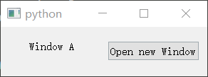
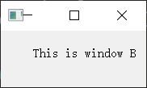
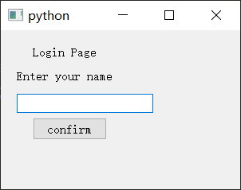
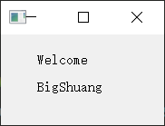
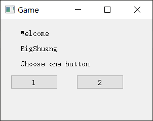
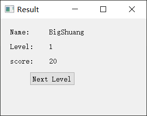

## pyqt5 笔记&教程 三 信号和槽 Signals & Slots 实现窗口跳转、返回、恢复、传参

### 6 信号与槽
信号和槽一般用于多个窗口之间传递信息，
或者前后端传递信息。


#### 定义信号
一般在`class`下面开头定义。
(`pyqt` 里面定义新对象时，如果不需要专门继承特定对象，推荐继承`PyQt5.QtCore.QObject`)

比如
```python
from PyQt5.QtCore import QObject, pyqtSignal

class A(QObject):
    sign_one = pyqtSignal()
```
其中`sign_one`就是我们定义的信号，是`PyQt5.QtCore.pyqtSignal`的一个实例。
#### 发射信号与绑定方法
发射信号很简单,使用`emit`方法就可以了。
示例
```python
self.sign_one.emit()
```
但是这个时候不会有效果，因为没有给信号绑定方法（槽函数）。

需要使用`connect`方法，给信号绑定对应的方法。
然后发射信号时，其绑定的方法就会被调用。
绑定语句示例
```python
self.sign_one.connect(someclass.method)
```

一个信号可以绑定多个槽函数，也就是可以给多个槽发信号。
一个槽函数也可以响应多个信号。

#### 信号传递参数
有的时候我们需要传递参数，让槽函数能够接受这些参数来运行。
那么这个时候的改动有这几处
1. 定义信号时，定义需要传递的参数类型。
   比如字符串`str`，整数`int`，甚至字典`dict`列表`list`。
2. 发射信号时，传参。
3. 接受信号的槽函数，要接受参数。


1的示例
```python
from PyQt5.QtCore import QObject, pyqtSignal

class A(QObject):
    sign_str = pyqtSignal(str)
    sign_int = pyqtSignal(int)
    sign_dict = pyqtSignal(dict)
    sign_list = pyqtSignal(list)
```

2的示例
```python
self.sign_str.emit("a string")
self.sign_int.emit(1)
self.sign_dict.emit({"a": 1})
self.sign_list.emit([1, 2, 3])
```

3 的示例就不太容易举了，因为这个取决于方法，
  即绑定的`method`能接受对应的参数并处理。

具体可以看后面的例子了
#### 小结

信号与槽的使用，主要就是上面三步走，
- 定义信号
- 发射信号
- 绑定方法

### 7 窗口跳转
#### 场景分析
希望实现的场景：A窗口中，点击按钮，打开B窗口，同时不再显示A窗口。

分析：
不显示一个窗口，一般使用隐藏。

#### 实现代码
```python
from PyQt5.QtWidgets import *
from PyQt5.QtCore import pyqtSignal

import sys


class Window_A(QWidget):
    sign_one = pyqtSignal()

    def __init__(self):
        super(Window_A, self).__init__()
        self.init_gui()

    def init_gui(self):
        self.label = QLabel("Window A", self)
        self.label.move(40, 20)

        self.button = QPushButton('Open new Window', self)
        self.button.move(150, 20)
        self.button.clicked.connect(self.click_button)

    def click_button(self):
        self.sign_one.emit()
        self.hide()


class Window_B(QWidget):

    def __init__(self):
        super(Window_B, self).__init__()
        self.init_gui()

    def init_gui(self):
        self.label = QLabel("This is window B", self)
        self.label.move(40, 20)

    def method_handle_sign(self):
        self.show()


app = QApplication(sys.argv)

win_a  = Window_A()
win_b = Window_B()

win_a.sign_one.connect(win_b.method_handle_sign)

win_a.show()

sys.exit(app.exec_())
```
A窗口效果


点击按钮打开B窗口
B窗口效果



### 8 窗口传参
#### 场景分析
希望实现的场景：
A窗口，作为简易登录窗口。
有输入框用于输入名字。
点击按钮，将名字发送给B窗口。

B窗口保存名字信息并展示，同时不再显示A窗口。

分析：
要传递名字，一般使用字符串形式传递，此时信号中要能够传递字符串信息。

#### 实现代码
```python
from PyQt5.QtWidgets import *
from PyQt5.QtCore import pyqtSignal

import sys


class Window_A(QWidget):
    sign_two = pyqtSignal(str)

    def __init__(self):
        super(Window_A, self).__init__()
        self.resize(300, 200)
        self.init_gui()

    def init_gui(self):
        label = QLabel("Login Page", self)
        label.move(40, 20)

        input_label = QLabel("Enter your name", self)
        input_label.move(20, 50)

        self.input_form = QLineEdit("", self)
        self.input_form.move(20, 80)

        self.button = QPushButton('confirm', self)
        self.button.move(40, 110)
        self.button.clicked.connect(self.click_button)

    def click_button(self):
        name = self.input_form.text()
        self.sign_two.emit(name)
        self.hide()


class Window_B(QWidget):

    def __init__(self):
        super(Window_B, self).__init__()
        self.name = ""
        self.init_gui()

    def init_gui(self):
        label = QLabel("Welcome", self)
        label.move(40, 20)

        self.name_label = QLabel(self.name, self)
        self.name_label.move(40, 50)


    def method_handle_sign2(self, name):
        self.name = name
        self.name_label.setText(self.name)
        self.show()


app = QApplication(sys.argv)

win_a  = Window_A()
win_b = Window_B()

win_a.sign_two.connect(win_b.method_handle_sign2)

win_a.show()

sys.exit(app.exec_())
```

A窗口效果



此时输入框中输入`BigShuang`并点击`confirm`按钮。

会打开窗口B， 如下


### 9 窗口返回与恢复

#### 场景分析
希望实现的场景：
B窗口，是一个游戏主窗口，展示当前关卡信息和几个按钮。
点击不同的按钮，可以发送不同的游戏结算信息给结算窗口C并展示C，且不显示B窗口。

C窗口展示结算信息，
C窗口有按钮进入下一关，
点击此按钮会展示B窗口进入下一关，再次隐藏C窗口。


分析：
要传递较多的信息，可以使用字典或者列表来传递，这里推荐使用字典。
此时信号中要能够传递字典信息。

#### 代码实现
```python
from PyQt5.QtWidgets import *
from PyQt5.QtCore import pyqtSignal

import sys


class Window_B(QWidget):
    sign_three = pyqtSignal(dict)

    def __init__(self):
        super(Window_B, self).__init__()

        self.name = "BigShuang"
        self.level = 1
        self.score = 0

        self.setWindowTitle("Game")
        self.resize(300, 200)
        self.init_gui()

    def init_gui(self):
        label1 = QLabel("Welcome", self)
        label1.move(40, 20)

        self.name_label = QLabel(self.name, self)
        self.name_label.move(40, 50)

        label2 = QLabel("Choose one button", self)
        label2.move(40, 80)

        button_1 = QPushButton("1", self)
        button_1.move(20, 110)

        button_2 = QPushButton("2", self)
        button_2.move(150, 110)

        button_1.clicked.connect(self.ending_1)
        button_2.clicked.connect(self.ending_2)

    def ending_1(self):
        self.score += 10
        self.send_info()

    def ending_2(self):
        self.score += 20
        self.send_info()

    def send_info(self):
        info = {
            "name": self.name,
            "level": self.level,
            "score": self.score
        }
        self.hide()
        self.sign_three.emit(info)

    def next_level(self):
        self.level += 1
        self.show()


class Window_C(QWidget):
    sign_four = pyqtSignal()

    def __init__(self):
        super(Window_C, self).__init__()

        self.resize(300, 200)
        self.setWindowTitle("Result")
        self.init_gui()

    def init_gui(self):
        label1 = QLabel("Name: ", self)
        label2 = QLabel("Level: ", self)
        label3 = QLabel("score: ", self)
        self.name_label = QLabel("", self)
        self.level_label = QLabel("", self)
        self.score_label = QLabel("", self)

        button = QPushButton("Next Level", self)

        label1.move(20, 20)
        label2.move(20, 50)
        label3.move(20, 80)

        self.name_label.move(100, 20)
        self.level_label.move(100, 50)
        self.score_label.move(100, 80)

        button.move(60, 110)
        button.clicked.connect(self.click_button)

    def show_result(self, info):
        self.name_label.setText(info["name"])
        self.level_label.setText(str(info["level"]))
        self.score_label.setText(str(info["score"]))

        self.show()

    def click_button(self):
        self.sign_four.emit()

app = QApplication(sys.argv)

win_b = Window_B()
win_c = Window_C()

win_b.sign_three.connect(win_c.show_result)
win_c.sign_four.connect(win_b.next_level)
win_c.sign_four.connect(win_c.hide)

win_b.show()

sys.exit(app.exec_())
```

运行该代码，会先展示窗口B
如下



此时点击按钮1和按钮2都会进入结算界面C。
（点击按钮1总分加10，按钮2总分加20）

比如点击按钮2进入结算界面，效果如下


此时点击`Next Level`会进入下一关，即隐藏结算界面，并再展示窗口B。
（且窗口B内部的关卡信息已更新）
