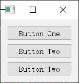

## pyqt5 笔记&教程 四 布局 Layout 对其

### 10 坐标布局
之前的代码里，很多地方使用了`move`方法，直接设置控件坐标。
这是一种通过写固定坐标进行布局的方式。
比较简单，但不够灵活。

这种布局常见的语法有
- `widget.move(x, y)`: 设置控件`widget`的位置
- `widget.resize(width, heigth)`: 设置控件`widget`的尺寸
- `widget.setGeometry(x, y, width, heigth)`: 设置控件`widget`的位置与尺寸

注意: 这个设置的是控件的，控件内部的文本大小与这个无关。

代码示例
```python
from PyQt5.QtWidgets import *
import sys


class Window(QWidget):
    def __init__(self):
        super(Window, self).__init__()
        self.resize(300, 200)
        self.init_gui()

    def init_gui(self):
        label = QLabel("Label One", self)
        label.move(20, 20)

        label2 = QLabel("Label Two", self)
        label2.move(20, 50)
        label2.resize(120, 40)

        label3 = QLabel("Label Three", self)
        label3.setGeometry(20, 90, 120, 60)

        button1 = QPushButton("Button One", self)
        button1.move(150, 20)

        button2 = QPushButton("Button Two", self)
        button2.move(150, 50)
        button2.resize(120, 40)

        button3 = QPushButton("Button Three", self)
        button3.setGeometry(150, 90, 120, 60)


app = QApplication(sys.argv)

win = Window()
win.show()

sys.exit(app.exec_())
```

运行效果如图


### 11 使用layout布局
#### 介绍
通过坐标进行布局虽然简单，但是不够灵活。
比如控件拖拽时不会自动调整，
且很多对其需要自己手动的计算。

使用各种`layout`类来布局则能避开这些麻烦。

四种常见`layout`如下
- `QVBoxLayout`: 竖向布局(延垂直方向)
- `QHBoxLayout`: 横向布局(延水平方向)
- `QGridLayout`: 网格布局

布局添加控件使用`addWidget`方法

#### QVBoxLayout
代码示例
```python
from PyQt5.QtWidgets import *
import sys


class Window(QWidget):
    def __init__(self):
        super(Window, self).__init__()
        self.init_gui()

    def init_gui(self):
        button1 = QPushButton("Button One", self)
        button2 = QPushButton("Button Two", self)
        button3 = QPushButton("Button Two", self)

        vbox = QVBoxLayout()
        vbox.addWidget(button1)
        vbox.addWidget(button2)
        vbox.addWidget(button3)

        self.setLayout(vbox)


app = QApplication(sys.argv)

win = Window()
win.show()

sys.exit(app.exec_())
```

运行效果如图


#### QHBoxLayout
代码示例
```python
from PyQt5.QtWidgets import *
import sys


class Window(QWidget):
    def __init__(self):
        super(Window, self).__init__()
        self.init_gui()

    def init_gui(self):
        button1 = QPushButton("Button One", self)
        button2 = QPushButton("Button Two", self)
        button3 = QPushButton("Button Two", self)

        hbox = QHBoxLayout()
        hbox.addWidget(button1)
        hbox.addWidget(button2)
        hbox.addWidget(button3)

        self.setLayout(hbox)


app = QApplication(sys.argv)

win = Window()
win.show()

sys.exit(app.exec_())
```

运行效果如图


#### QGridLayout
`addWidget`方法参数
- `addWidget(widget, row, column)`: 指定行和列
- `addWidget(widget, row, column, rowSpan, columnSpan)`
指定行列，和占据行数(跨几行)，占据列数(跨几列)。


代码示例
```python
from PyQt5.QtWidgets import *
import sys


class Window(QWidget):
    def __init__(self):
        super(Window, self).__init__()
        self.init_gui()

    def init_gui(self):
        buttons = [
            QPushButton(str(i), self) for i in range(7)
        ]

        grid = QGridLayout()

        # addWidget(widget, row, column)
        # row 0
        grid.addWidget(buttons[0], 0, 0)
        grid.addWidget(buttons[1], 0, 1)
        grid.addWidget(buttons[2], 0, 2)
        grid.addWidget(buttons[3], 0, 3)

        # row 1
        grid.addWidget(buttons[4], 1, 0)
        grid.addWidget(buttons[5], 1, 1)
        # addWidget(widget, row, column, rowSpan, columnSpan)
        grid.addWidget(buttons[6], 1, 2, 1, 2)

        self.setLayout(grid)


app = QApplication(sys.argv)

win = Window()
win.show()

sys.exit(app.exec_())
```

运行效果如图


### 12 Layout 嵌套布局
布局添加子布局使用`addLayout`方法

使用`QVBoxLayout`和`QHBoxLayout`实现网格效果。

示例如下
```python
from PyQt5.QtWidgets import *
import sys


class Window(QWidget):
    def __init__(self):
        super(Window, self).__init__()
        self.init_gui()

    def init_gui(self):

        vbox = QVBoxLayout()
        label = QLabel("The Title", self)

        hbox1 = QHBoxLayout()
        for i in range(3):
            button = QPushButton(str(i), self)
            hbox1.addWidget(button)

        hbox2 = QHBoxLayout()
        for i in range(4):
            button = QPushButton(str(i), self)
            hbox2.addWidget(button)

        vbox.addWidget(label)
        vbox.addLayout(hbox1)
        vbox.addLayout(hbox2)

        self.setLayout(vbox)

app = QApplication(sys.argv)

win = Window()
win.show()

sys.exit(app.exec_())
```

运行效果如图


### 13 对其

布局可以设置对其方式
对其类`Align...`在`PyQt5.QtCore.Qt`中
常用的有
- `AlignCenter`: 居中
- `AlignLeft`: 居左
- `AlignRight`: 居右
- `AlignTop`: 居顶
- `AlignBottom`: 居底

导入包含对其类的`Qt`
```python
from PyQt5.QtCore import Qt
```

设置`layout`居中对其
```python
layout.setAlignment(Qt.AlignCenter)
```
