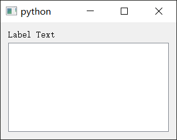
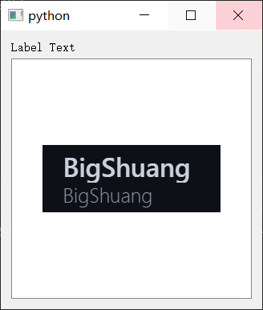

## pyqt5笔记 入门 运动游戏 QGraphicsView 和 QGraphicsScene

### 1 位图移动逻辑基础实现
运动游戏的核心基础是，通过按键能够实现图片的运动（比如上下左右移动）。

虽然使用`QLabel`也能够展示图片，并且通过`setGeometory`也能设定位置，但是这样处理运动并不友好。

更推荐使用`QGraphicsView`和`QGraphicsScene`。

#### QGraphicsView和QGraphicsScene
这两个要一般要一起配合使用。
其中`QGraphicsView`作为控件，占据面板一片区域。
`QGraphicsScene`则作为场景，用于添加位图项目。

基础代码如下
```python
from PyQt5.QtWidgets import *
from PyQt5.QtGui import QPixmap
from PyQt5.QtCore import *

import sys


class MyWindow(QWidget):
    def __init__(self):
        super(MyWindow, self).__init__()
        self.resize(300, 200)
        self.init_gui()

        self.show()

    def init_gui(self):
        box = QVBoxLayout()
        label = QLabel("Basic Move", self)

        self.view = QGraphicsView()
        self.scene = QGraphicsScene()
        self.view.setScene(self.scene)

        box.addWidget(label)
        box.addWidget(self.view)

        self.setLayout(box)
```

效果如图


注意这几行
```python
self.view = QGraphicsView()
self.scene = QGraphicsScene()
self.view.setScene(self.scene)

box.addWidget(self.view)
```

- `QGraphicsView`使用`QGraphicsScene`作为场景
- `QGraphicsView`可以看作控件添加到上级的`layout`中。

动画区域要添加运动的图片，则是`QGraphicsScene`来添加。
比如添加一个图片，且实现基础的移动功能。

此时里面的位图要使用`QGraphicsPixmapItem`控件来展示。
#### 添加图片与运动
添加图片和响应键盘操作运动。
可以在`MyWindow`类添加如下方法
```python
def set_view(self):
    self.item = QGraphicsPixmapItem()  # 新建QGraphicsPixmapItem对象用于显示图片
    self.item.setPixmap(QPixmap("my_logo.png"))  # 设置位图
    self.item.setPos(100, 100)  # 设置图片位置
    self.scene.addItem(self.item)  # 添加图片到scene中

    self.view.setFixedSize(300, 300)  # 设置view为固定尺寸 300x300
    self.view.setHorizontalScrollBarPolicy(Qt.ScrollBarAlwaysOff) # 关闭水平方向滚动条
    self.view.setVerticalScrollBarPolicy(Qt.ScrollBarAlwaysOff)  # 关闭竖直方向滚动条

def keyPressEvent(self, event):
    if event.key() == Qt.Key_W:  # 按W键上移
        self.item.setPos(self.item.x(), self.item.y()-10)
    elif event.key() == Qt.Key_S:  # 按S键上移
        self.item.setPos(self.item.x(), self.item.y()+10)
    elif event.key() == Qt.Key_A:  # 按A键左移
        self.item.setPos(self.item.x()-10, self.item.y())
    elif event.key() == Qt.Key_D:  # 按D键右移
        self.item.setPos(self.item.x()+10, self.item.y())
```
且在`init_gui`方法中(末尾处)添加一句代码
```python
self.set_view()
```

此时效果如图

此时按方向键就可以移动图片了。
#### 总代码
```python
from PyQt5.QtWidgets import *
from PyQt5.QtGui import QPixmap
from PyQt5.QtCore import *

import sys


class MyWindow(QWidget):
    def __init__(self):
        super(MyWindow, self).__init__()
        self.resize(300, 200)
        self.init_gui()

        self.show()

    def init_gui(self):
        box = QVBoxLayout()
        label = QLabel("Label Text", self)

        self.view = QGraphicsView()
        self.scene = QGraphicsScene()
        self.view.setScene(self.scene)

        box.addWidget(label)
        box.addWidget(self.view)

        self.set_view()
        self.setLayout(box)

    def set_view(self):
        self.item = QGraphicsPixmapItem()  # 新建QGraphicsPixmapItem对象用于显示图片
        self.item.setPixmap(QPixmap("my_logo.png"))  # 设置位图
        self.item.setPos(100, 100)  # 设置图片位置
        self.scene.addItem(self.item)  # 添加图片到scene中

        self.view.setFixedSize(300, 300)  # 设置view为固定尺寸 300x300
        self.view.setHorizontalScrollBarPolicy(Qt.ScrollBarAlwaysOff) # 关闭水平方向滚动条
        self.view.setVerticalScrollBarPolicy(Qt.ScrollBarAlwaysOff)  # 关闭竖直方向滚动条

    def keyPressEvent(self, event):
        if event.key() == Qt.Key_W:  # 按W键上移
            self.item.setPos(self.item.x(), self.item.y()-10)
        elif event.key() == Qt.Key_S:  # 按S键上移
            self.item.setPos(self.item.x(), self.item.y()+10)
        elif event.key() == Qt.Key_A:  # 按A键左移
            self.item.setPos(self.item.x()-10, self.item.y())
        elif event.key() == Qt.Key_D:  # 按D键右移
            self.item.setPos(self.item.x()+10, self.item.y())


app = QApplication(sys.argv)
win = MyWindow()
sys.exit(app.exec_())
```
