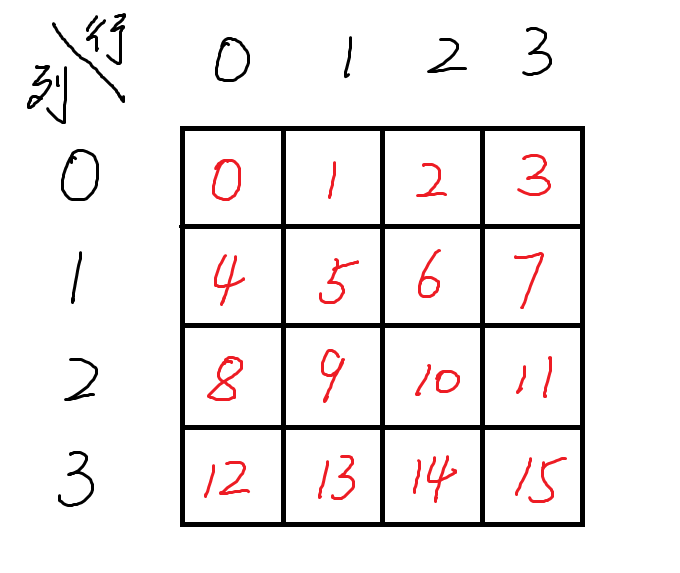

## 递归算法进化之回溯算法(backtracking)

> 前置知识： 递归算法(recursion algorithm)。
> 我的递归教程: [【教程】python递归三部曲（基于turtle实现可视化）](https://www.bilibili.com/video/BV1RJ411774T)
> 回溯与递归的关系：
> 回溯是一种算法思想，递归是实现方式。

回溯法经典问题：
八皇后问题、数独问题。

（其实两个很像）

### 八皇后问题
八皇后问题是一个以国际象棋为背景的问题：

如何在8×8的国际象棋棋盘上放置八个皇后，使其不互相攻击。
即任两个皇后都不能处于同一条横行、纵行或斜线上。

#### n皇后问题
八皇后问题可以推广为更一般的n皇后摆放问题：这时棋盘的大小变为n×n，而皇后个数也变成n。

(当且仅当n = 1 或 n ≥ 4时问题有解)

#### 4皇后问题
八皇后讨论起来比较麻烦，先讨论四皇后情况(n=4)

首先展示下错误的情况:


如上图所示，三个图的错误分别是
1. 第一行有重复了
2. 对角线有重复了。(注意有两个对角线)
3. 第一列有重复

想要正确，则每一行每一列，每个对角线(对角线有两个方向)都不能有重复项。

正确的情况示例如下：


### 回溯法
回溯法(backtracking)是暴力搜索法中的一种。

其核心思想就是不断尝试，不行就后退再试其他的。

关于这一思想，我之前有个视频，感觉能比较形象地展示，感兴趣可以看看：

[迷宫探索动画](https://www.bilibili.com/video/av39266846/)

接下来我们用回溯法探究下刚才的4皇后问题。

### 回溯法过程展示
个人感觉用行列坐标表示不够直观，所以给每个格子从前往后依次编号。
后面用编号来称呼位置（无特殊说明的话）
如下图



同时四个皇后从前往后按次序编为
$Q_1$、$Q_2$、$Q_3$、$Q_4$

原始的回溯法
每次会从前往后依次尝试每个编号的位置。

> 为了简化谈论，以下先进行了一定的优化。

由于每行不能重复，n个皇后必须分别放在n行上。
当有一行放不下了时。也就失败了。

所以
$Q_1$必须放在第一行(行索引为0)
$Q_2$必须放在第二行(行索引为1)
$Q_3$必须放在第三行(行索引为2)
$Q_4$必须放在第四行(行索引为3)

#### 1 $Q_1$放位置0

使用回溯法，$Q_2$仍然会从0开始尝试，发现放不了，就往后走。

由于$Q_1$放位置0。所以
0、1、2、3、
4、8、12、
5、10、15都放不了

$Q_2$从第二行开头试。
即从4、5开始试，一直试到6才能够放下，那么就先放在这里。

##### $Q_2$放位置6
那么接下来继续尝试$Q_3$，
会发现第三行(行索引为2)已经放不了了。
如下图


这说明

**$Q_2$放位置6失败**

回来重新放$Q_2$，放位置7
##### $Q_2$放位置7
此时$Q_3$唯一能放的位置只有9。
之后，$Q_4$已经无处可放。

如下图

这说明

**$Q_2$放位置7失败**

##### $Q_2$无位置可放

$Q_2$无位置可放，
说明$Q_1$放在位置0失败。
$Q_1$需要尝试其他位置，即尝试先放在位置1。


> 到这里回溯法的特点其实就已经展现的比较够了：
> 即不断向下尝试，如果所有尝试都失败，那就后退一步，重新尝试。

#### 2 $Q_1$放位置1
此时$Q_2$只能放在位置7，
之后$Q_3$只能放在位置8，
最后$Q_3$只能放在位置14，

即如下图所示


到这里，如果只要求找到一个解法，问题就已经结束了，如果要找到所有解法，那就是继续往后不断尝试。

### 代码实现
#### 原始回溯法代码
```python
class NQueens:
    def __init__(self, n):
        self.n = n
        # 保存每个皇后的坐标, (ci, ri)
        # 第一行第一列的皇后坐标为(0, 0)
        self.one_solution = []

    def check_can_place(self, ri, ci):
        for pos in self.one_solution:
            pc, pr = pos
            if pc == ci:  # 行检测
                return False

            if pr == ri:  # 列检测
                return False

            if pr - pc == ri - ci:  # 对角线检测 1
                return False

            if pr + pc == ri + ci:  # 对角线检测 2
                return False

        return True

    def solve(self):
        for ri in range(self.n):
            for ci in range(self.n):
                if self.check_can_place(ri, ci):
                    pos = (ci, ri)
                    self.one_solution.append(pos)

                    if len(self.one_solution) == self.n:
                        return True

                    res = self.solve()
                    if res:
                        return True
                    else:
                        self.one_solution.pop()

        return False

    def show_in_board(self):
        board = [
            ["-" for i in range(self.n)] for j in range(self.n)
        ]
        for pos in self.one_solution:
            pc, pr = pos
            board[pr][pc] = "Q"

        for row in board:
            print(" ".join(row))


nq = NQueens(8)
res = nq.solve()
if res:
    print("Queens positions:")
    print(nq.one_solution)
    print("Queens in board:")
    nq.show_in_board()
```


输出结果
```txt
Queens positions:
[(0, 0), (4, 1), (7, 2), (5, 3), (2, 4), (6, 5), (1, 6), (3, 7)]
Queens in board:
Q - - - - - - -
- - - - Q - - -
- - - - - - - Q
- - - - - Q - -
- - Q - - - - -
- - - - - - Q -
- Q - - - - - -
- - - Q - - - -
```
#### `check_can_place`方法解析
> 该方法，用于检查指定的横纵坐标，是否还能防止皇后（不与已经放置的皇后冲突）

检查是否能放置
行和列好分析，对角线情况则比较麻烦。
两种对角线图示如下


第一种对角线（红色对角线）
每一条对角线上格子，$r-c$都是相同的值。
可以通过这个值来判断是否在同一条对角线上。

第二种对角线（绿色对角线）
每一条对角线上格子，$r+c$都是相同的值。
可以通过这个值来判断是否在同一条对角线上。

#### `solve`方法解析
```python
def solve(self):
    for ri in range(self.n):
        for ci in range(self.n):
            # 从前往后尝试所有的位置，看是否能放皇后
            if self.check_can_place(ri, ci):
                # 成功则添加
                pos = (ci, ri)
                self.one_solution.append(pos)

                if len(self.one_solution) == self.n:
                    # 皇后数量已到达n，问题解决，返回解决成功
                    return True

                # 走到这里，说明还没解决

                # 递归调用自身，看当前情况往后是否能够解决成功
                res = self.solve()
                if res:
                    # 成功，就继续返回解决成功
                    return True
                else:
                    # 失败，之前添加的pos方法，是不成功的，将其弹出，之后继续尝试
                    self.one_solution.pop()

    return False
```
### 代码优化与拓展
#### 优化：一行一试
上面的原始回溯法的代码。
每一次放皇后都是从前往后一个一个试，效率很低。

这里按照上文讨论中的思路进行优化，
即每一行放一个皇后。

那么代码里面就是每一行，从第一列开始一直尝试到最后一列。
一行放好后，就往下一行进行尝试。

这里只需要给`NQueens`类添加一个新方法`solve_advanced`即可
```python
def solve_advanced(self, ri=0):
    for ci in range(self.n):
        if self.check_can_place(ri, ci):
            pos = (ci, ri)
            self.one_solution.append(pos)

            if ri == self.n - 1:
                return True

            res = self.solve_advanced(ri+1)
            if res:
                return True
            else:
                self.one_solution.pop()

    return False
```

调用时的`res = nq.solve()`改成`res = nq.solve_advanced()`即可。

输出和原始回溯法时的输出是一样的。
不过代码运行的速度会得到很大提升。

不仅如此，优化后的代码在去求所有解时，不会求出重复情况。
#### 拓展：获得所有解（不重复）
求所有解的代码在优化后的方法上，简单调整以下就好
- 不再返回（即不会试到一个成功的就退出）
- 成功后将结果记录，记录时要使用切片进行拷贝。

首先，先在`NQueens`的`__init__`方法中添加新的属性，用于记录解决方法。
```python
self.solutions = []
```

然后给`NQueens`类添加新方法`solve_all`
```python
def solve_all(self, ri=0):
    for ci in range(self.n):
        if self.check_can_place(ri, ci):
            pos = (ci, ri)
            self.one_solution.append(pos)

            if ri == self.n - 1:
                self.solutions.append(self.one_solution[:])
            else:
                self.solve_all(ri+1)

            self.one_solution.pop()
```

然后修改下`show_in_board`方法。
因为原来的方法只能展示`self.one_solution`。
这里希望也能够展示别的`solution`

修改后的`show_in_board`如下
```python
def show_in_board(self, sol=None):
    board = [
        ["-" for i in range(self.n)] for j in range(self.n)
    ]
    if sol is None:
        sol = self.one_solution

    for pos in sol:
        pc, pr = pos
        board[pr][pc] = "Q"

    for row in board:
        print(" ".join(row))
```
#### 总代码
一个`NQueens`的实例，只能调用三个方法中的一个(一次)
- `solve`
- `solve_advanced`
- `solve_all`

重复调用可能会出问题（需要再调用，建议新建`NQueens`实例）

以下总代码中只展示`solve_all`的调用结果。
且由于八皇后问题的解太多(有92个)，
以下只展示下六皇后问题的调用求解

```python
class NQueens:
    def __init__(self, n):
        self.n = n
        # 保存每个皇后的坐标, (ci, ri)
        # 第一行第一列的皇后坐标为(0, 0)
        self.one_solution = []

        self.solutions = [

        ]

    def check_can_place(self, ri, ci):
        for pos in self.one_solution:
            pc, pr = pos
            if pc == ci:  # 行检测
                return False

            if pr == ri:  # 列检测
                return False

            if pr - pc == ri - ci:  # 对角线检测 1
                return False

            if pr + pc == ri + ci:  # 对角线检测 2
                return False

        return True

    def solve(self):
        for ri in range(self.n):
            for ci in range(self.n):
                if self.check_can_place(ri, ci):
                    pos = (ci, ri)
                    self.one_solution.append(pos)

                    if len(self.one_solution) == self.n:
                        return True

                    res = self.solve()
                    if res:
                        return True
                    else:
                        self.one_solution.pop()

        return False

    def solve_advanced(self, ri=0):
        for ci in range(self.n):
            if self.check_can_place(ri, ci):
                pos = (ci, ri)
                self.one_solution.append(pos)

                if ri == self.n - 1:
                    return True

                res = self.solve_advanced(ri+1)
                if res:
                    return True
                else:
                    self.one_solution.pop()

        return False

    def solve_all(self, ri=0):
        for ci in range(self.n):
            if self.check_can_place(ri, ci):
                pos = (ci, ri)
                self.one_solution.append(pos)

                if ri == self.n - 1:
                    self.solutions.append(self.one_solution[:])
                else:
                    self.solve_all(ri+1)

                self.one_solution.pop()

    def show_in_board(self, sol=None):
        board = [
            ["-" for i in range(self.n)] for j in range(self.n)
        ]
        if sol is None:
            sol = self.one_solution

        for pos in sol:
            pc, pr = pos
            board[pr][pc] = "Q"

        for row in board:
            print(" ".join(row))


nq = NQueens(6)

nq.solve_all()
for si in range(len(nq.solutions)):
    sol = nq.solutions[si]
    print("=== Solution %s ===" % si)
    print("Queens positions:")
    print(sol)
    print("Queens in board:")
    nq.show_in_board(sol)
```
#### 输出
总代码的输出如下
```txt
=== Solution 0 ===
Queens positions:
[(1, 0), (3, 1), (5, 2), (0, 3), (2, 4), (4, 5)]
Queens in board:
- Q - - - -
- - - Q - -
- - - - - Q
Q - - - - -
- - Q - - -
- - - - Q -
=== Solution 1 ===
Queens positions:
[(2, 0), (5, 1), (1, 2), (4, 3), (0, 4), (3, 5)]
Queens in board:
- - Q - - -
- - - - - Q
- Q - - - -
- - - - Q -
Q - - - - -
- - - Q - -
=== Solution 2 ===
Queens positions:
[(3, 0), (0, 1), (4, 2), (1, 3), (5, 4), (2, 5)]
Queens in board:
- - - Q - -
Q - - - - -
- - - - Q -
- Q - - - -
- - - - - Q
- - Q - - -
=== Solution 3 ===
Queens positions:
[(4, 0), (2, 1), (0, 2), (5, 3), (3, 4), (1, 5)]
Queens in board:
- - - - Q -
- - Q - - -
Q - - - - -
- - - - - Q
- - - Q - -
- Q - - - -
```


### 参考文档
- [Backtracking](https://en.wikipedia.org/wiki/Backtracking)
